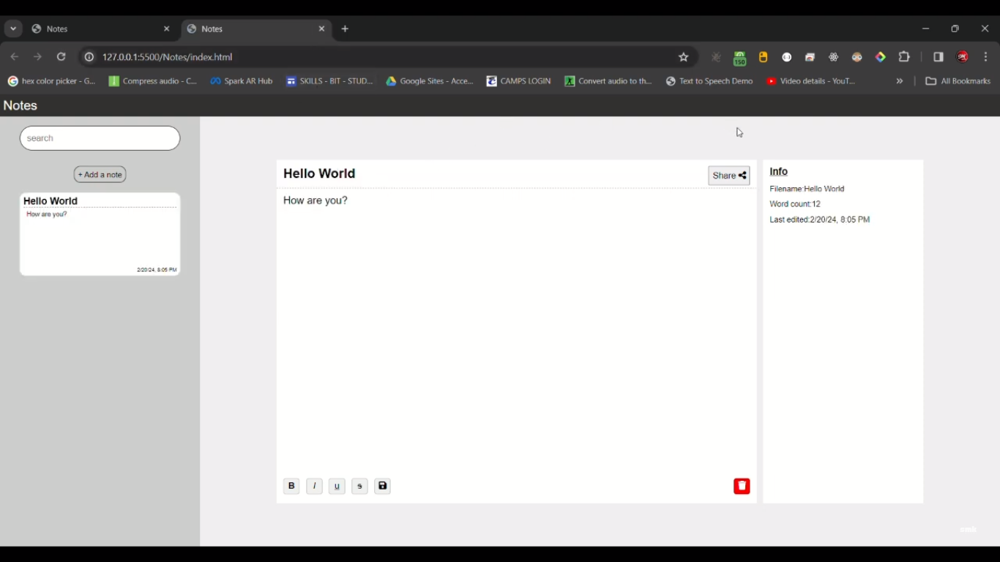

# Notes

### Output



### Front-end
1. HTML
2. CSS
3. JS
   
### Back-end
1. Java
2. MYSQL

### Establish Database connection in Java

Download the connector jar and add it to the build path
1. [MYSQL](https://dev.mysql.com/downloads/connector/j/)


#### MYSQL
```
Class.forName("com.mysql.cj.jdbc.Driver");
String dbURL = "jdbc:mysql://localhost:3306/YOUR_DATABASENAME";
String user = "YOUR_USERNAME";
String pass = "YOUR_PASSWORD";
this.con = DriverManager.getConnection(dbURL, user, pass);
```

```
### Create table
#### MYSQL
```
CREATE TABLE IF NOT EXISTS notes_table (
    id INT AUTO_INCREMENT PRIMARY KEY,
    title VARCHAR(255) NOT NULL,
    content TEXT NOT NULL,
    last_edit TIMESTAMP NOT NULL DEFAULT CURRENT_TIMESTAMP
);
```

